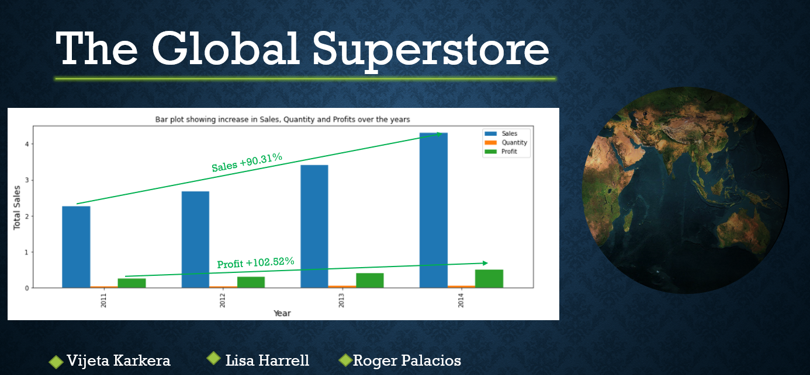

#### Global Superstore is an online retailer based in New York. It aims to be a one stop shop for its customers, hailing from 147 different countries. The customers can browse through a broad product category catalogue of more than 10,000 products. The dataset which can be found at https://www.kaggle.com/apoorvaappz/global-super-store-dataset consists of 51k rows of data on purchases made around the world by the segments, consumers, corporate and home office. 

This analysis will answer 4 questions:
1. What people are buying
2. Which segments account for the majority of consumer purchases
3. Which countries accounted for the greatest profits
4. What factors contributed to the profits
